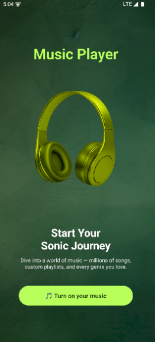
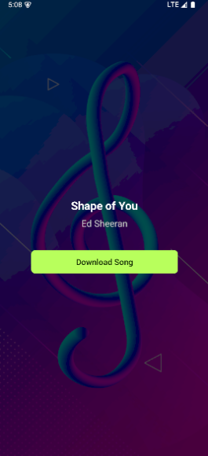

<h1 align="center">🎵 Song List & Download App</h1>

<p align="center">
  <b>A React Native mini-project</b><br/>
  Display a list of songs from an API and download them directly from the app.
</p>

---

## ✨ Features

- 🏠 **Home Screen** with gradient background & headphones illustration  
- 📜 **Song List Screen**  
  - Fetches songs from mock API  
  - Shows song thumbnail, title, artist  
  - Download button per item  
- 🎶 **Song Details Screen**  
  - Large artwork and metadata  
  - Download button with loader  
- ⬇️ **Downloads** stored in app’s `DocumentDirectoryPath` via `react-native-fs`  
- 🔄 Loader + ✅ success alerts  
- 🧭 **Navigation** with React Navigation (Stack)  
- 🛠️ **State Management** with Redux Toolkit (RTK)  
- ♻️ Clean architecture & reusable components  

------

## 📂 Project Structure
```bash
src/
 ├── api/
 │   └── songsApi.js
 ├── components/
 │   └── SongItem.js
 ├── navigation/
 │   └── AppNavigator.js
 ├── screens/
 │   ├── HomeScreen.js
 │   ├── SongListScreen.js
 │   └── SongDetailsScreen.js
 └── utils/
     └── downloadHelper.js
```
---

## 📥 Clone Repository
```bash
git clone https://github.com/ezhilarasid/SongListDownloadApp.git
cd SongListDownloadApp
```
------

## 📦 Install Dependencies
```bash
npm install
```
------


## 🔧 Install Required Packages
```bash
npm install @react-navigation/native @react-navigation/stack
npm install react-native-screens react-native-safe-area-context react-native-gesture-handler
npm install react-native-fs
npm install @reduxjs/toolkit react-redux
```
------

## 🍏 iOS Setup (Mac only)
```bash
cd ios && pod install && cd ..
```
------

## ▶️ Run the App
📡 Start Metro Bundler
```bash
npx react-native run-android
```
------

## 🤖 Run on Android
```bash
npx react-native start
```
------

## 🍏 Run on iOS
```bash
npx react-native run-ios
```
------

## 🛠️ Tech Stack

⚛️ React Native CLI
🟣 Redux Toolkit (RTK)
🧭 React Navigation (Stack)
📂 react-native-fs (file handling)

------

## 👩‍💻 Author

Ezhilarasi Durai
------

## 📸 Screenshots

<p align="center">
  
  
  
</p>


